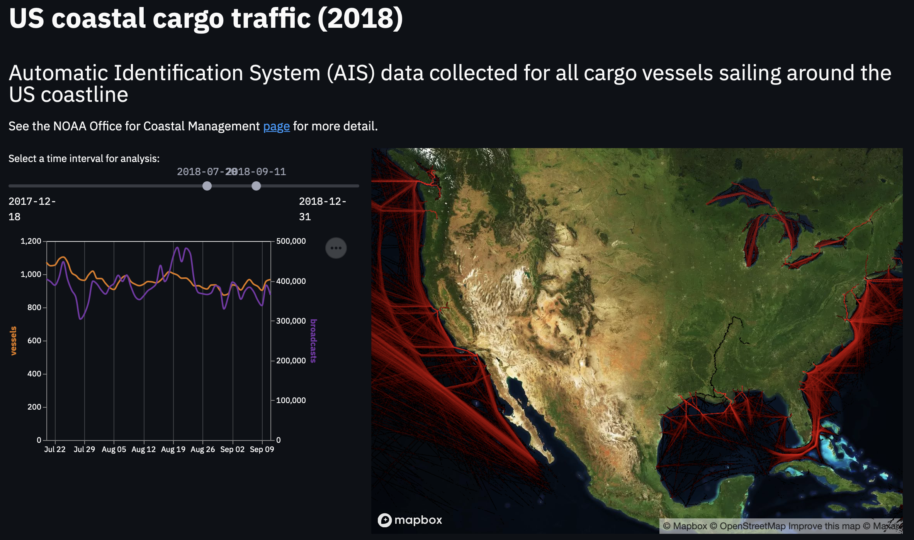

# Streamlit-based interactive tool for exploring AIS data
This repository demonstrates querying a geospatial dataset stored in Databricks Delta (using the Databricks Connect component) and presenting the results in a Streamlit reactive dashboard.

### Getting started
- Clone the repository.
- Create a new conda environment or venv as preferred and install the dependencies in `requirements.txt`.
- Configure [Databricks Connect](https://docs.databricks.com/dev-tools/databricks-connect.html) to connect to a Databricks cluster running DBR 8.1.
- Update the `config-example.yaml` to include:
  - a [mapbox public API key](https://account.mapbox.com/auth/signup/); and 
  - the name of a Delta table, described below, registered in your workspace data catalogue;

  and save the file locally as `config.yaml`.
- Run the Streamlit server with `streamlit run app.py` from the shell.
- Follow the link to access the dashboard through your browser.

### Creating the Delta table to support this demo
To create the dataset for this demo:
- Create (or obtain access to a) Databricks cluster running DBR 8.1.
- Run through the first two notebooks in this [blog post](https://databricks.com/blog/2020/11/11/leveraging-esg-data-to-operationalize-sustainability.html) to download the 2018 AIS cargo vessel data, install the `H3` library and write the raw AIS dataset to Delta.
- Run the code contained in the included notebook `compute-indexes.dbc` in `/assets/` to create a date partitioned dataset with H3 indexes.
